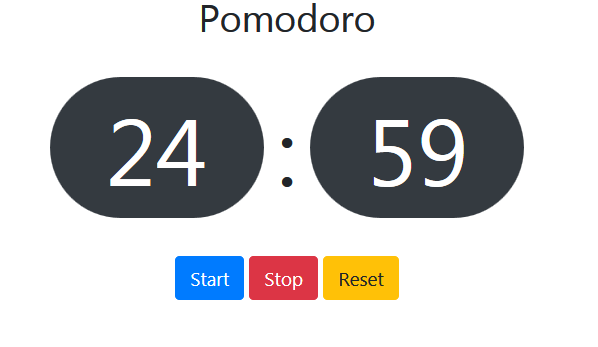

# PomodoroJS

>A Pomodoro iterative implementation in plain Javascript using ES6.

In each iteration, the refactoring is done to write better code.

## This repository has 3 folders

* First Implementations
* Second Implementation
* Third Implementation

### First Implementation

* All the Javascript code is in single file.

### Second Implementation

* Promote reusability by creating Modules using ES6
* All the HTML Controls and logic is encapsulated in a Module.
* The CountDownTime is created as a reusable Module.
* Main JS file imports the Modules and compose the logic using these modules.

### Third Implementation

* Build on top of the Second implementation
* Abstracts away the logic for controlling the state of button in the View Module.

